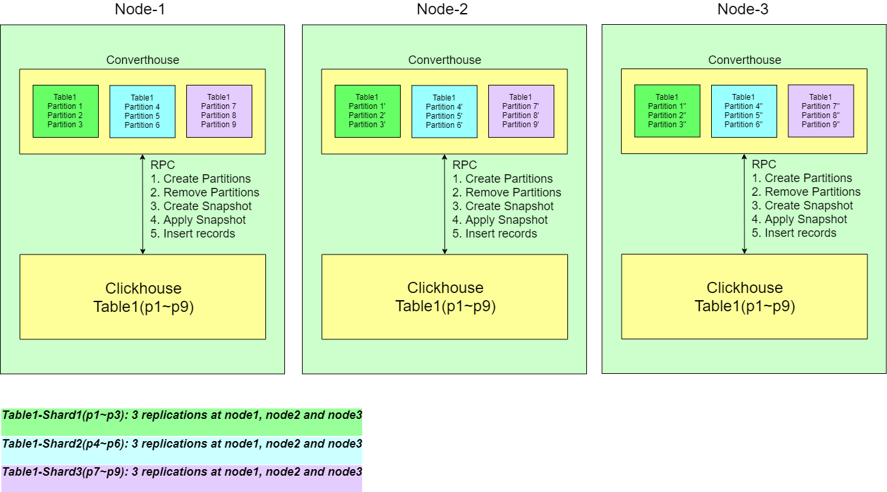
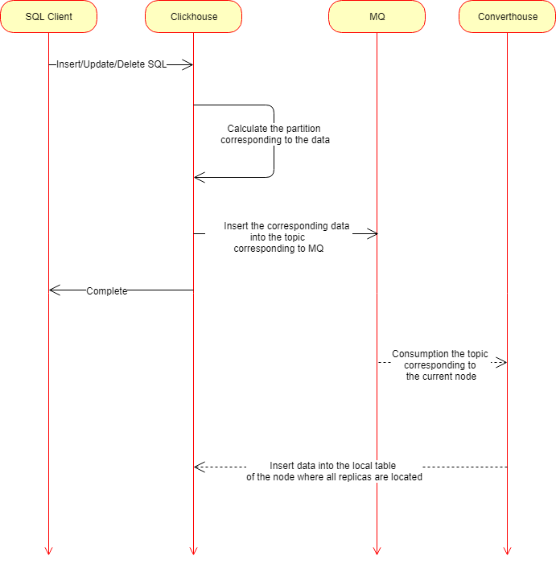
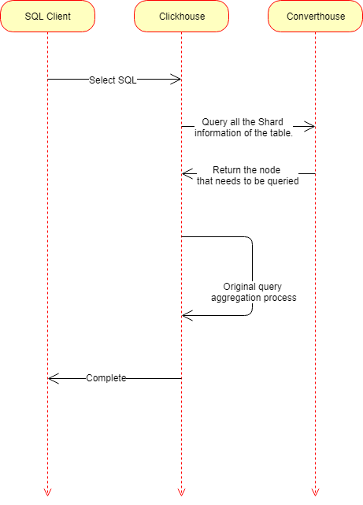
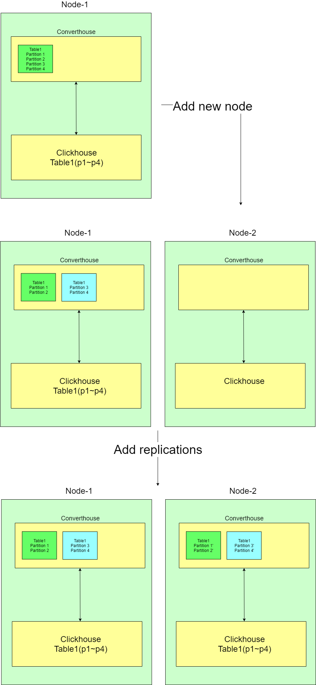

## The Design of Converthouse
This article describes the original design of Converthouse, and issues that need to be addressed.

### Motivation
At present, the distributed tables of Clickhouse could not saitisfy our requirements in terms of scalability, auto-rebalance, and performance. Therefore, we propose to implement Converthouse, to help Clickhouse manage distributed tables better, such that Clickhouse could be more cloud-native friendly.

### What is Converthouse?
Converthouse is a stand-alone process developed using the Go language to help Clickhouse better manage distributed tables. The initial design is as follows:
1. On each node where Clickhouse runs, a Converthouse instance is also running.
2. Converthouse is responsible for the high availability of the replication set of Clickhouse's distributed tables, scale-out, auto-rebalance.
3. Converthouse and Clickhouse interacted with each other through RPC to provide the necessary interfaces to each other (see the subsequent process for details).
4. Minimize the impact on Clickhouse insertion and query performance.

### Architecture

### Concept
#### Shard
A Table is divided into multiple Shards, and each Shard manages a part of the Partition. Note that the set of Partitions managed by this shard will change during the running of the system, therefore Partition forms the fundamental building block of auto-rebalance. A Table corresponds to multiple shards. So Table:Shard = 1:N, Shard:Partition=1:N. 

#### Replication
Each shard will have multiple copies on different machines. The data corresponding to the shard on each machine is called a Replication of this shard.

### Process
#### Create Table
1. Clickhouse receives the DDL statement and creates a distributed table locally.
2. Clickhouse calls Converthouse's creation shard interface to create the first shard of this Table.
3. Converthouse will asynchronously create the Replication of this shard on other machines until the number of Replications is met.
4. The Converthouse on the other machine receives the Create Replication request and calls the Clickhouse interface to create the corresponding local distributed table.

#### Replication data sync
Each shard will have multiple Replications. Each Replication inserts new data by consuming data in the Topic of MQ. The rules for Topic in MQ are: TableName+Partition. So a Replication consumes the Topic of multiple Partitions it manages. It can be seen that the data between Replications is ultimately consistent.

#### Insert

1. The client executes a DML statement that modifies the data to any Clickhouse instance in the cluster.
2. Clickhouse calculates which Partitions of the modified data associations according to the Table rules, and then inserts the data into the corresponding MQ Topic.
3. Return to the client to execute successfully
3. Converthouse's Shard consumption corresponds to the MQ's Topic to get the data, call the local Clickhouse's modified data interface to complete the data modification.

#### Query

1. Clickhouse receives the query statement and obtains the Clickhouse instance that needs to be queried through the interface of the Table Shard provided by Converthouse.
2. A query will be sent to all Shards of Clickhouse to get the results and return to the client.

#### Replication Leader Election 
1. Converthouse embeds Etcd to provide distributed lock and leader elections
2. A leader will be selected between multiple replications for each shard.
3. Leader's add, remove, and scale operations for handling Replication.

#### Scale-out

1. Converthouse found a new node in the cluster
2. Converthouse schedules all shards of all Tables in the entire cluster for split processing
3. Each shard splits into 2 shards from the middle of the Partition collection it manages, for example from s1[p1, p4] -> s1[p1,p2], s2[p3~p4]
4. Relocate some Shards to the new node through the subsequent Rebalance process to achieve balance

#### Rebalance
1. Converthouse will select a leader from the entire cluster to use as a scheduler.
2. Leader's Converthouse instance has a global metadata view.
3. Each Shard's leader acquires scheduling operations through heartbeat and communications with the leader of Converthouse.
4. The rebalance is eventually reached in terms of the number of shards, the number of leaders, the amount of stored data across all nodes.

### Questions
1. Whether Shard and Partition can be 1:1, then the complexity will be much lower during scaling out.

### Need help
1. Currently the development of Converthouse is almost finished. I hope the community could help to maintaine together.
2. Hope someone in the community can join to adjust Clickhouse together, to help the cloud native Clickhouse be ready as soon as possible.
