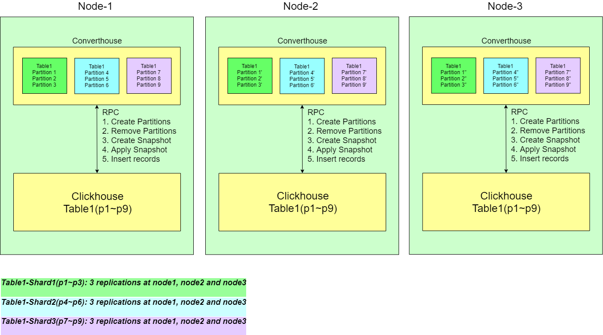
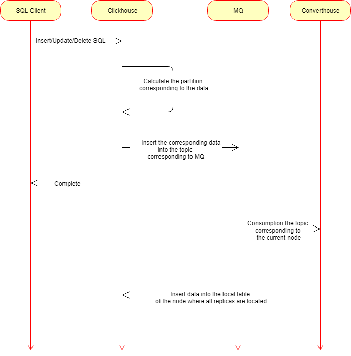
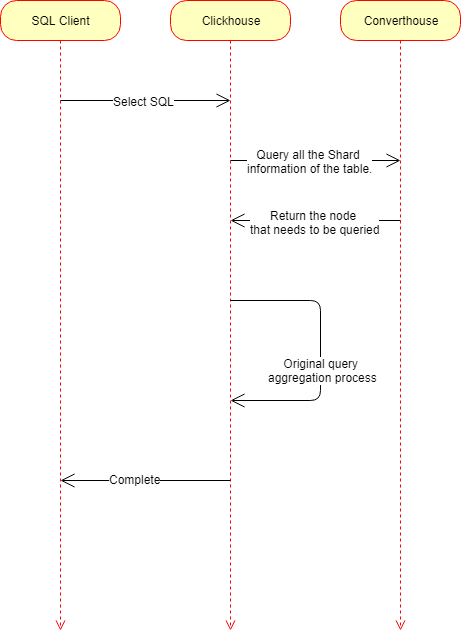
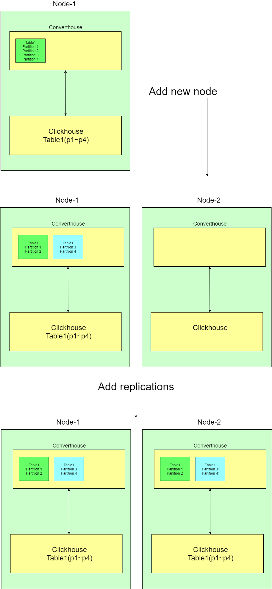

## Converthouse设计
本文描述Converthouse的设计初衷，设计方案，以及需要解决的问题。

### Why?
目前Clickhouse对于分布式Table的管理，在Scale-out，Rebalance这块处理的不满足我们的需求，并且Zookeeper过多的参与到了副本管理机制中，导致插入性能收到影响，因此我们提出实现Converthouse来帮助Clickhouse来更好的实现分布式Table。

### What is Converthouse?
Converthouse是一个使用Go语言开发的独立进程，来帮助Clickhouse更好的管理分布式Table，实现更多的分布式Table的特性。我们的设计目标如下：
1. 每个Clickhouse运行实例的节点上，都会运行一个Converthouse实例。
2. Converthouse负责Clickhouse的分布式Table的副本的高可用，Scale-out，Rebalance。
3. Converthouse和Clickhouse之前通过RPC交互，相互提供必要的接口（具体参见后续流程）。
4. 尽可能的减少对Clickhouse插入和查询性能的影响。

### Architecture

### 概念
#### Shard
一个Table划分为多个Shard,每个Shard管理一部分的Partition。注意，在系统的运行过程中，这个Shard所管理的Partition集合是会发生变化的。一个Table对应多个Shard。所以Table:Shard = 1:N，Shard:Partition=1:N。

#### Replication
每个Shard会存在多个副本存在放不同的机器上，每个机器上对应该Shard的数据就称为这个Shard的一个Replication。

### 流程
#### Create Table
1. Clickhouse收到DDL语句，在本地创建分布式Table
2. Clickhouse调用Converthouse的创建Shard接口，创建这个Table的第一个Shard
3. Converthouse会异步的在其他的机器上创建这个Shard的Replication，直到满足Replication个数
4. 其他机器上的Converthouse收到创建Replication请求，并且调用Clickhouse的接口创建对应的本地分布式Table

#### Replication data sync
每个Shard都会有多个Replication。每个Replication通过消费MQ的Topic中的数据来插入新的数据。在MQ中的Topic的规则是：TableName+Partition。所以一个Replication会消费它管理的多个Partition的Topic。可见Replication之间的数据是最终一致的。

#### Insert

1. 客户端执行一条修改数据的DML语句到集群中任意一个Clickhouse实例
2. Clickhouse根据Table规则，计算这批修改的数据关联的Partition是哪些，然后把数据插入到对应的MQ的Topic中
3. 返回客户端执行成功
3. Converthouse的Shard消费对应的MQ的Topic得到数据，调用本地Clickhouse的修改数据接口完成数据的修改

#### Query

1. Clickhouse收到查询语句，通过Converthouse提供的查询Table Shard的接口得到需要查询的Clickhouse实例
2. 并发查询所有的Shard的Clickhouse，得到查询结果，聚合处理，返回客户端

#### Replication Leader 选举
1. Converthouse内嵌Etcd来提供分布式锁和Leader选举功能
2. 每个Shard的多个Replication之间会选出一个Leader
3. Leader用来处理Replication的add, remove以及Scale操作

#### Scale-out

1. Converthouse发现集群中新增了一个节点
2. Converthouse调度整个集群中的所有Table的所有Shard，进行分裂处理
3. 每个Shard从它管理的Partition集合的中间分裂为2个Shard，例如从s1[p1, p4] -> s1[p1,p2], s2[p3~p4]
4. 通过后续的Rebalance流程把一些Shard搬迁到新的节点上，达到平衡

#### Rebalance
1. Converthouse会从整个集群中选取出一个Leader，用来作为调度器
2. Leader的Converthouse实例具备全局的元数据视图
3. 每个Shard的Leader通过心跳和Converthouse的Leader通信来获取调度操作
4. 最终达到所有节点的shard个数，leader个数，存储数据的balance

### 一些疑问
1. Shard和Partition是否可以1:1，那么在Scale-out的时候，复杂程度会降低很多。

### 需要的帮助
1. 目前Converthouse的开发工作，已经快要结束。希望社区能有人一起维护。
2. 希望社区有人可以一起修改Clickhouse。
